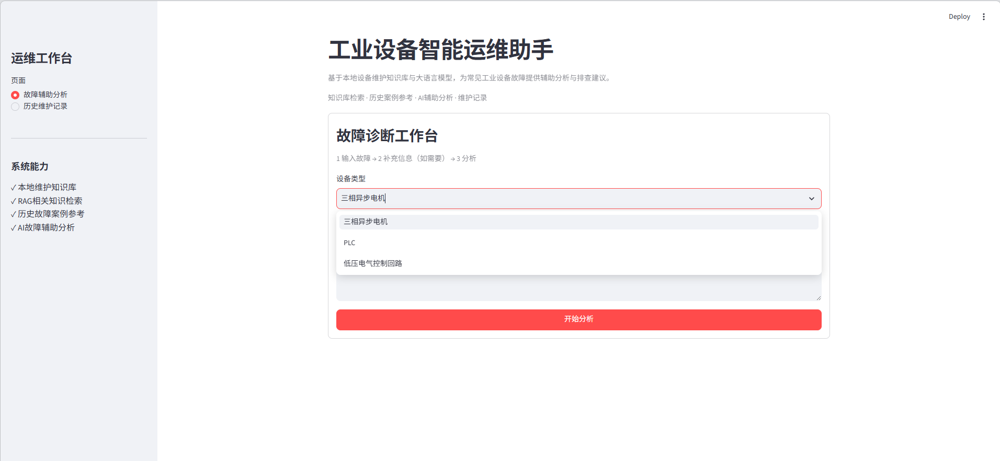
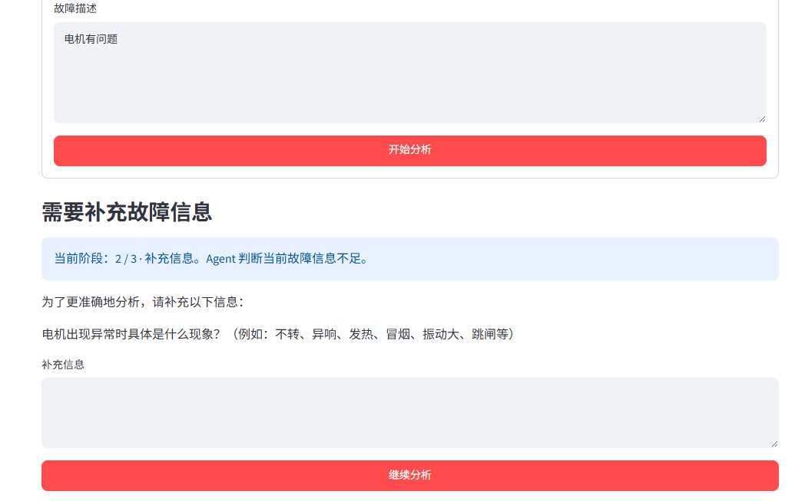
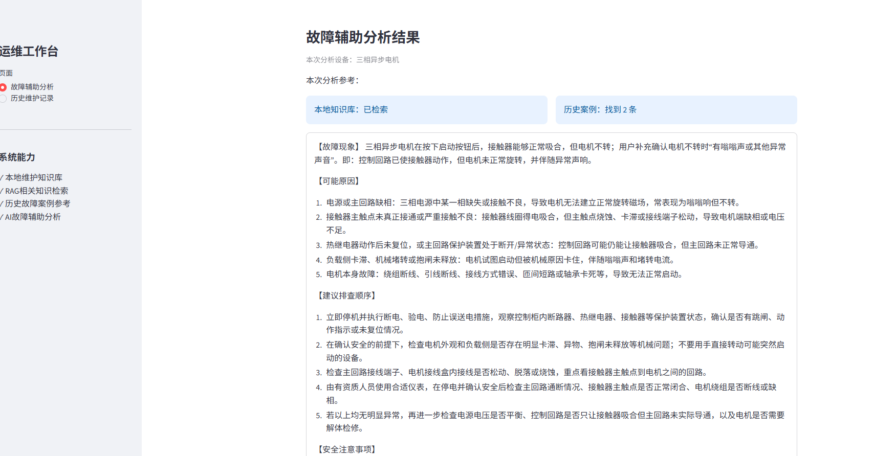
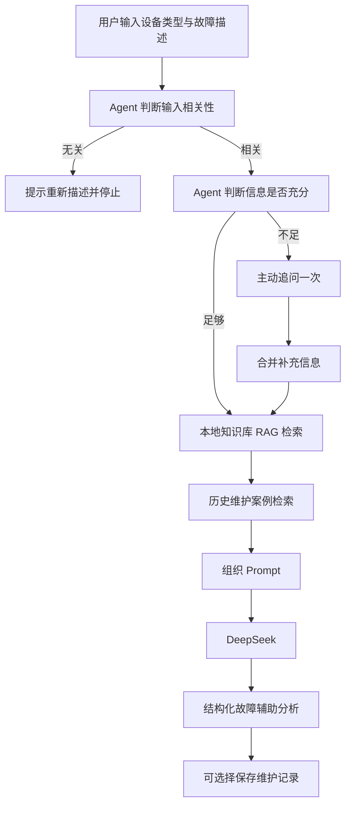

# 工业设备智能运维 Agent

> 基于大语言模型、RAG 与历史维护案例检索的工业设备故障辅助分析系统。

## 1. 项目简介

本项目面向自动化专业学习和工业设备维护辅助分析场景。用户选择设备类型并描述故障后，系统会先判断描述是否与所选设备的故障或运行异常相关，再判断当前信息是否足够。信息不足时，系统通过大语言模型主动提出一个补充问题；用户回答后，系统再继续分析。

在信息可以继续分析时，程序会读取本地设备维护资料，切分 Markdown 知识，使用 TF-IDF 和余弦相似度检索相关内容，同时检索相同设备类型的历史维护案例，最后调用 DeepSeek 生成辅助分析结果。分析结果包括可能原因、建议排查顺序、安全注意事项和初步结论，并可以保存为维护记录供后续案例参考。

本项目是辅助分析系统，不能替代专业维修人员、设备说明书或现场安全规程。模型输出不能作为直接操作依据。

## 2. 运行效果

### 故障诊断工作台



页面提供设备类型选择、故障描述输入和开始分析入口。

### Agent 主动请求补充信息



当当前描述不足以支持初步分析时，Agent 会先提出一个补充问题。

### 故障辅助分析结果



系统在分析结果中展示可能原因、排查顺序、安全注意事项和初步结论。

## 3. 项目功能

当前 V1.0 已实现：

- Streamlit 故障辅助分析页面和历史维护记录页面；
- 三相异步电机、PLC、低压电气控制回路三类设备选择；
- 使用本地 Markdown 文件维护设备知识；
- 按 Markdown 标题切分知识 Chunk；
- 使用字符级 TF-IDF 和余弦相似度检索本地知识；
- 使用 `top_k=2` 和最低相似度阈值过滤低相关结果；
- 使用 DeepSeek 判断输入是否与所选设备故障相关；
- 使用 DeepSeek 判断故障信息是否充分；
- 信息不足时最多主动追问一轮；
- 检索相同设备类型的历史维护案例，并显示相似度；
- 将本地知识和历史案例作为辅助资料加入分析 Prompt；
- 输出故障现象、可能原因、建议排查顺序、安全注意事项和初步结论；
- 使用 JSON 保存维护记录，并按时间查看历史记录；
- 在开发调试区域查看原始知识、Chunk、本地检索结果和历史案例。

## 4. 系统工作流程



当相关性判断明确返回无关时，流程会停止，不执行本地知识检索、历史案例检索和正式故障分析。

## 5. 技术栈

- Python；
- Streamlit：构建页面和交互；
- OpenAI Python SDK：通过 OpenAI 兼容客户端访问 DeepSeek API；
- DeepSeek `deepseek-chat`：执行相关性判断、信息充分度判断和故障辅助分析；
- scikit-learn：提供 `TfidfVectorizer` 和 `cosine_similarity`；
- Markdown：编写本地设备维护知识；
- JSON：保存维护记录；
- `python-dotenv`：从 `.env` 读取 API Key。

当前项目没有实现 Embedding 语义检索、向量数据库、FAISS、Chroma、LangChain、LlamaIndex 或 Multi-Agent。此前的 Embedding 环境验证没有成功，因此 V1.0 仍使用 TF-IDF 检索。

## 6. RAG 实现

当前 V1.0 的 RAG 流程是：

```text
Markdown 知识库
      |
      v
按标题或自然段 Chunk 分块
      |
      v
TfidfVectorizer(analyzer="char", ngram_range=(2, 4))
      |
      v
余弦相似度计算
      |
      v
按分数排序，取 Top-K
      |
      v
过滤低于 min_score=0.05 的结果
      |
      v
将相关 Chunk 加入 Prompt
```

这里的 TF-IDF 是字符特征检索方法，不是 Embedding。当前实现不建立向量数据库，也不使用外部文档检索框架。

本地知识文件位于 `knowledge/`，当前包括：

- `motor.md`：三相异步电机；
- `plc.md`：PLC；
- `electrical.md`：低压电气控制回路。

## 7. Agent 机制

`agent.py` 提供两个判断函数：

1. `evaluate_fault_relevance()`：判断输入是否在描述所选设备的故障、异常现象、运行问题或维护问题。明确无关时，页面提示用户重新描述并停止本次分析。
2. `evaluate_fault_information()`：判断故障描述是否具备初步分析所需的基本信息。信息不足时，只生成一个问题。

页面使用 `st.session_state` 保存原始描述、Agent 问题和用户补充信息，因此点击“继续分析”后可以恢复上下文。第一版最多追问一轮，不是无限循环，也不是多 Agent 系统。

如果判断接口返回非法 JSON 或调用异常，程序采用兼容性兜底，继续原有辅助分析流程，避免页面因格式问题崩溃。

## 8. 历史维护案例

维护记录由 `maintenance_record.py` 使用 Python 标准库保存到：

```text
data/maintenance_records.json
```

每条记录包括：

- `id`：UUID；
- `created_at`：本地可读时间；
- `equipment_type`：设备类型；
- `fault_description`：故障描述；
- `analysis_result`：模型分析结果；
- `status`：默认值为“待处理”。

`history_retriever.py` 只比较相同设备类型的历史记录，并对历史故障描述使用同样的字符级 TF-IDF 和余弦相似度，返回 Top-K 且达到最低分数的案例。

历史案例只是辅助参考。即使当前描述与历史案例相似，也不能直接认定当前故障原因相同；模型仍需结合当前故障和本地知识重新分析。

## 9. 项目目录

```text
agent1/
├── app.py                         # Streamlit 页面和主流程
├── agent.py                       # 相关性、信息充分度和追问判断
├── diagnosis.py                   # 组织故障分析 Prompt
├── retriever.py                   # 本地知识 TF-IDF 检索
├── history_retriever.py           # 历史案例 TF-IDF 检索
├── knowledge_loader.py            # 读取知识文件和 Chunk 分块
├── llm_client.py                  # DeepSeek API 客户端
├── maintenance_record.py          # JSON 维护记录读写
├── knowledge/
│   ├── motor.md
│   ├── plc.md
│   └── electrical.md
├── data/
│   └── maintenance_records.json   # 运行时维护记录
├── requirements.txt
├── .env.example
├── .gitignore
└── README.md
```

真实 `.env`、Python 缓存目录和 API Key 不应上传到公开仓库；`.env` 已在 `.gitignore` 中忽略。

## 10. 本地运行方法

建议使用项目自己的虚拟环境。PowerShell 示例：

```powershell
cd D:\agent1
py -m venv .venv
.\.venv\Scripts\python.exe -m pip install -r requirements.txt
```

复制配置示例：

```powershell
Copy-Item .env.example .env
```

编辑项目根目录的 `.env`，填写自己的 DeepSeek API Key：

```env
OPENAI_API_KEY=your_deepseek_api_key_here
```

不要把真实 Key 写入代码、README 或提交到 GitHub。

启动 Streamlit：

```powershell
py -m streamlit run app.py
```

浏览器访问：<http://localhost:8501>

如果使用虚拟环境，也可以执行：

```powershell
.\.venv\Scripts\python.exe -m streamlit run app.py
```

## 11. 使用示例

设备类型：

```text
三相异步电机
```

故障描述：

```text
按下启动按钮后，接触器能够正常吸合，但是电机不转。
```

系统可能先判断信息是否足够。如果需要更多现场现象，页面会提出一个补充问题。信息足够或完成补充后，程序会检索电机知识 Chunk 和相同设备类型的历史案例，再生成辅助分析。

示例不代表固定故障结论。实际原因需要根据现场信息、设备状态和安全规程确认。

## 12. 安全设计

- 信息不足时提示需要进一步检查，不强行给出唯一故障结论；
- 历史案例仅作为参考，不能替代当前设备的现场判断；
- 涉及电气设备时，优先强调停机、断电、验电和防止误送电；
- 不向无资质人员提供带电拆接、带电测量等危险操作指导；
- 危险检查和维修应由具备资质的人员按现场规程执行；
- 模型输出是文字辅助建议，不是实际维修指令。

## 13. 项目局限与后续方向

当前项目的局限：

- 本地知识库规模较小，覆盖设备类型有限；
- TF-IDF 主要依赖字符特征匹配，对同义表达的理解有限；
- Agent 判断和追问流程较简单，当前只追问一轮；
- 应用是本地 Streamlit 程序，尚未做在线部署；
- 维护记录使用本地 JSON，未引入数据库和并发管理。

后续可以考虑：

- 使用 Embedding 升级语义检索；
- 扩充设备维护知识库和历史维护案例；
- 增加更细的维护记录状态管理；
- 探索设备图像辅助分析；
- 部署在线 Demo。

这些是后续方向，不是当前 V1.0 已实现的功能。

## 14. 项目声明

本项目用于 Python、Streamlit、RAG 和工业设备维护辅助分析学习，也可作为自动化专业学生的项目展示。它不能替代专业维修判断、设备说明书、企业检修制度或现场安全规程。

